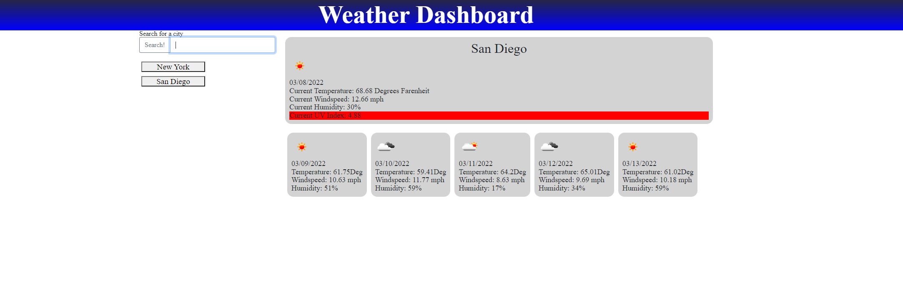

# Homework6-weather-dashboard-api

https://bppearsall.github.io/Homework6-weather-dashboard-api/

## Functions
When I search for a city I receive current weather data and a forecast data for the next 5 days.

The city that I search is added underneath the search area as a clickable link to go back to that cities weather forecast

I am given currents days infromation on temperature, humidity, wind speed, and UV index

UV index changes color depending on the what value gets returned to denote how safe it is to be outside in the sun

Five Day forecast are all displayed on unique cards that produce API information for each of individual card.

